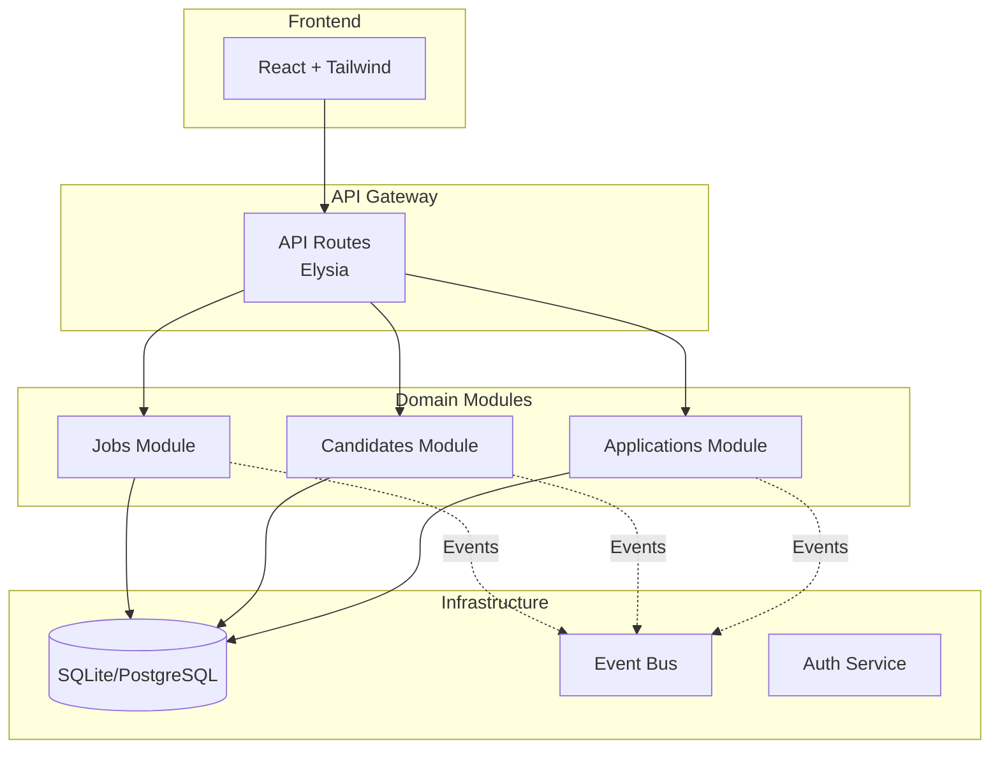

# HR Recruitment System

A modern, scalable recruitment management system built with a modular monolith architecture that can evolve into microservices.

## Quick Start

```bash
# 1. Clone and install
git clone https://github.com/your-org/hr-recruitment-system.git
cd hr-recruitment-system
bun install

# 2. Setup environment
cp .env.example .env

# 3. Run migrations
bun run db:migrate

# 4. Start development server
bun run dev

# 5. Open http://localhost:3000
```

## Architecture Overview



## Key Features

### For Recruiters
- **Job Management**: Create, publish, and manage job postings
- **Candidate Pipeline**: Track candidates through screening, interviews, and offers
- **Interview Scheduling**: Automated scheduling with calendar integration
- **Analytics Dashboard**: Real-time metrics on hiring performance

### For Candidates
- **Job Discovery**: Browse and search open positions
- **Application Tracking**: Monitor application status in real-time
- **Document Management**: Upload and manage resumes and portfolios
- **Communication**: Direct messaging with recruiters

### For Hiring Managers
- **Requisition Workflow**: Submit and track hiring requests
- **Interview Feedback**: Structured evaluation forms
- **Collaboration**: Share candidate profiles and feedback with team
- **Decision Support**: Data-driven insights for hiring decisions

## Tech Stack

- **Runtime**: [Bun](https://bun.sh) - Fast all-in-one JavaScript runtime
- **Backend**: [Elysia](https://elysiajs.com) - Type-safe web framework
- **Frontend**: [React](https://react.dev) + [Tailwind CSS](https://tailwindcss.com)
- **Database**: SQLite (dev) / PostgreSQL (production)
- **ORM**: [Drizzle](https://orm.drizzle.team) - TypeScript ORM
- **Validation**: [Zod](https://zod.dev) - Schema validation
- **Authentication**: [Lucia](https://lucia-auth.com) - Type-safe auth

## Project Structure

```
hr-recruitment-system/
├── src/
│   ├── api/              # API routes and server setup
│   ├── modules/          # Domain modules (jobs, candidates, etc.)
│   ├── shared/           # Shared infrastructure and utilities
│   └── frontend/         # React application
├── tests/                # Test suites
├── docs/                 # Documentation
└── scripts/              # Build and deployment scripts
```

## Development Setup

### Prerequisites

- [Bun](https://bun.sh) >= 1.0
- Node.js >= 18 (for some tooling)
- Git

### Installation

1. **Clone the repository**
   ```bash
   git clone https://github.com/your-org/hr-recruitment-system.git
   cd hr-recruitment-system
   ```

2. **Install dependencies**
   ```bash
   bun install
   ```

3. **Environment setup**
   ```bash
   cp .env.example .env
   # Edit .env with your configuration
   ```

4. **Database setup**
   ```bash
   bun run db:migrate
   bun run db:seed # Optional: Add sample data
   ```

5. **Start development server**
   ```bash
   bun run dev
   ```

6. **Run tests**
   ```bash
   bun test
   ```

## Available Scripts

- `bun run dev` - Start development server with hot reload
- `bun run build` - Build for production
- `bun run start` - Start production server
- `bun test` - Run test suite
- `bun run lint` - Lint code
- `bun run format` - Format code with Prettier
- `bun run db:migrate` - Run database migrations
- `bun run db:seed` - Seed database with sample data

## API Documentation

Once the server is running, API documentation is available at:
- Swagger UI: http://localhost:3000/swagger
- OpenAPI JSON: http://localhost:3000/swagger/json

## Architecture Decisions

We use Architecture Decision Records (ADRs) to document significant decisions:

- [ADR-001: Modular Monolith Architecture](docs/adr/001-modular-monolith.md)
- [ADR-002: Event-Driven Communication](docs/adr/002-event-driven.md)
- [ADR-003: Repository Pattern](docs/adr/003-repository-pattern.md)

## Contributing

Please read our [Contributing Guide](CONTRIBUTING.md) for details on our code of conduct and the process for submitting pull requests.

### Commit Convention

We use [Conventional Commits](https://www.conventionalcommits.org/):

- `feat:` New features
- `fix:` Bug fixes
- `docs:` Documentation changes
- `style:` Code style changes (formatting, etc.)
- `refactor:` Code refactoring
- `test:` Test additions or modifications
- `chore:` Build process or auxiliary tool changes

## Testing

### Running Tests

```bash
# Run all tests
bun test

# Run specific test file
bun test src/modules/jobs/jobs.service.test.ts

# Run tests in watch mode
bun test --watch

# Run tests with coverage
bun test --coverage
```

### Test Structure

- **Unit Tests**: Test individual functions and classes
- **Integration Tests**: Test module interactions
- **E2E Tests**: Test complete user workflows

## Deployment

### Docker

```bash
# Build Docker image
docker build -t hr-recruitment-system .

# Run with Docker Compose
docker-compose up -d
```

### Production Environment

1. Set production environment variables
2. Run database migrations
3. Build the application
4. Start with process manager (PM2, systemd, etc.)

## Monitoring

- **Health Check**: GET `/health`
- **Metrics**: GET `/metrics` (Prometheus format)
- **Logs**: Structured JSON logging with correlation IDs

## Security

- JWT-based authentication with refresh tokens
- Role-based access control (RBAC)
- Input validation with Zod schemas
- SQL injection protection via parameterized queries
- XSS protection with React's default escaping
- CORS configuration for API access
- Rate limiting on sensitive endpoints

## Performance

- Efficient database queries with proper indexing
- Response caching with Redis
- Pagination for large datasets
- Optimistic UI updates
- Code splitting for faster initial load

## Future Roadmap

### Phase 1: MVP (Current)
- ✅ Core job posting and application flow
- ✅ Basic interview scheduling
- ✅ User authentication
- 🔄 Email notifications

### Phase 2: Enhanced Features
- [ ] AI-powered candidate matching
- [ ] Video interview integration
- [ ] Advanced analytics dashboard
- [ ] Mobile applications

### Phase 3: Scale & Integrate
- [ ] Microservices migration
- [ ] Multi-tenant support
- [ ] Advanced integrations (ATS, HRIS)
- [ ] International support

## Support

- **Documentation**: [docs.hr-recruitment.com](https://docs.hr-recruitment.com)
- **Issues**: [GitHub Issues](https://github.com/your-org/hr-recruitment-system/issues)
- **Discussions**: [GitHub Discussions](https://github.com/your-org/hr-recruitment-system/discussions)

## License

This project is licensed under the MIT License - see the [LICENSE](LICENSE) file for details.

---

Built with ❤️ by Your Team
